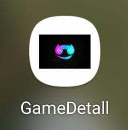

# Uts Pemogramanan Mobile

# Game Detail

  
  

## 👤 Profil Mahasiswa

| Atribut            | Keterangan                    |
| ------------------ | ----------------------------- |
| **Nama**           | Ali Mubaroq                 |
| **NIM**            | 312310452                     |
| **Kelas**          | TI.23.A.5                     |
| **Mata Kuliah**    | Pemrograman Mobile 1          |
| **Dosen Pengampu** | Donny Maulana S.kom., M.M.S.I |

---

##  Selamat Datang di Aplikasi **Game Detail**!

# Aplikasi Game Detail

Selamat datang di project Aplikasi Game Detail! Aplikasi ini dirancang untuk memudahkan pengguna dalam mencari penjelasan singkat tentang GAME, aplikasi ini suda dilengkapi dengan fitur favorit untuk pengalaman pengguna yang lebih terorganisir dan nyaman.

## Tujuan Aplikasi

Tujuan aplikasi Detail Game adalah memberikan informasi singkat dan padat tentang game, membantu pengguna mengenal genre, gameplay, pengembang, serta memberikan rekomendasi atau panduan untuk memilih game sesuai preferensi mereka.

---

## 📝 Storyboard

## 🎨 Mockup

## 💻 UI/UX Preview

---

# Aplikasi Resep Sehat

## Status Proyek: Phase 1 Initial Development

Pada tahap pertama ini, fokus kami adalah membangun fondasi utama Aplikasi RGame Detail. Kami mengembangkan fitur inti seperti tampilan beranda, navigasi ke halaman setiap game, dan navigasi ke halaman favorit. Desain pada tahap ini masih minimalis, dengan tujuan memastikan stabilitas dan fungsionalitas dasar aplikasi.

Progres :

halaman utama aplikasi "deskripsi game" yang berisi tiga tombol utama: mobile legend, wukong, dan chaind together. Desainnya sederhana dengan latar belakang putih dan tombol berwarna lembut. Halaman ini diatur melalui MainActivity dalam proyek Android Studio.

## Catatan Pengembangan:

- Desain UI masih dalam tahap awal dan akan terus disempurnakan
- Fungsionalitas pencarian dan penyimpanan resep favorit akan dikembangkan lebih lanjut pada fase berikutnya
- Pengoptimalan performa dan perbaikan bug akan dilakukan secara berkelanjutan

Aplikasi Game Detail terus berkembang untuk menyediakan pengalaman pengguna yang lebih baik dalam menemukan dan mencoba resep-resep sehat.

## Status Proyek: Phase 2 - Peningkatan Fitur dan Pengalaman Pengguna

Pada tahap kedua ini, kami fokus pada peningkatan fungsionalitas dan pengalaman pengguna Aplikasi Resep Sehat. Kami telah menambahkan fitur-fitur baru dan menyempurnakan yang sudah ada untuk memberikan pengalaman yang lebih baik kepada pengguna.

## Apa yang Baru di Phase 2?

1. Implementasi fitur Favorit yang berfungsi penuh
2. Penambahan Splash Screen saat membuka aplikasi
3. Peningkatan fungsionalitas pencarian
4. Penyempurnaan antarmuka pengguna untuk navigasi yang lebih intuitif

## Launcher Icon

Ikon aplikasi utama yang muncul di layar beranda atau daftar aplikasi pada perangkat pengguna. Launcher Icon dirancang untuk mencerminkan identitas visual Resep Sehat yang modern, sederhana, dan profesional. Dengan desain baru, ikon ini dibuat:

Launcher Icon ini bertujuan untuk segera mengkomunikasikan tujuan aplikasi Game Detail kepada pengguna, menarik perhatian mereka di antara berbagai aplikasi lain di perangkat mereka.

## Fitur Utama Aplikasi:

### 1. Splash Screen

### 2. Halaman Utama

### 2. Halaman Penjelasan

### 2. Halaman Detail Game

## Peningkatan Teknis:

- Optimalisasi performa aplikasi untuk loading yang lebih cepat
- Perbaikan bug dan peningkatan stabilitas
- Peningkatan responsivitas UI untuk berbagai ukuran layar

## Teknologi yang Digunakan:

- Frontend: Android (Java)
- Desain: Material Design

## Cara Menggunakan Aplikasi

1. **Pilih Resep**: Telusuri pilihan game di beranda.

2. **Lihat Detail Resep**: Klik pilihan game untuk melihat informasi lengkap, termasuk bahan-bahan dan langkah-langkah pembuatan.

3. **Tambahkan ke Favorit**: Jika Anda menyukai resep tersebut, gunakan opsi "Add To Favorite" untuk menyimpannya di halaman favorit Anda.

4. **Akses Halaman Favorit**: Kunjungi halaman favorit untuk melihat game yang telah Anda simpan dan akses dengan cepat.

Aplikasi Resep Sehat dirancang untuk memudahkan Anda dalam menemukan dan mencoba berbagai resep sehat dengan cara yang menyenangkan dan terorganisir!
